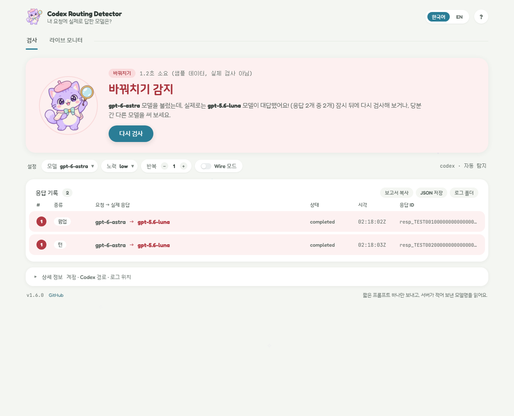
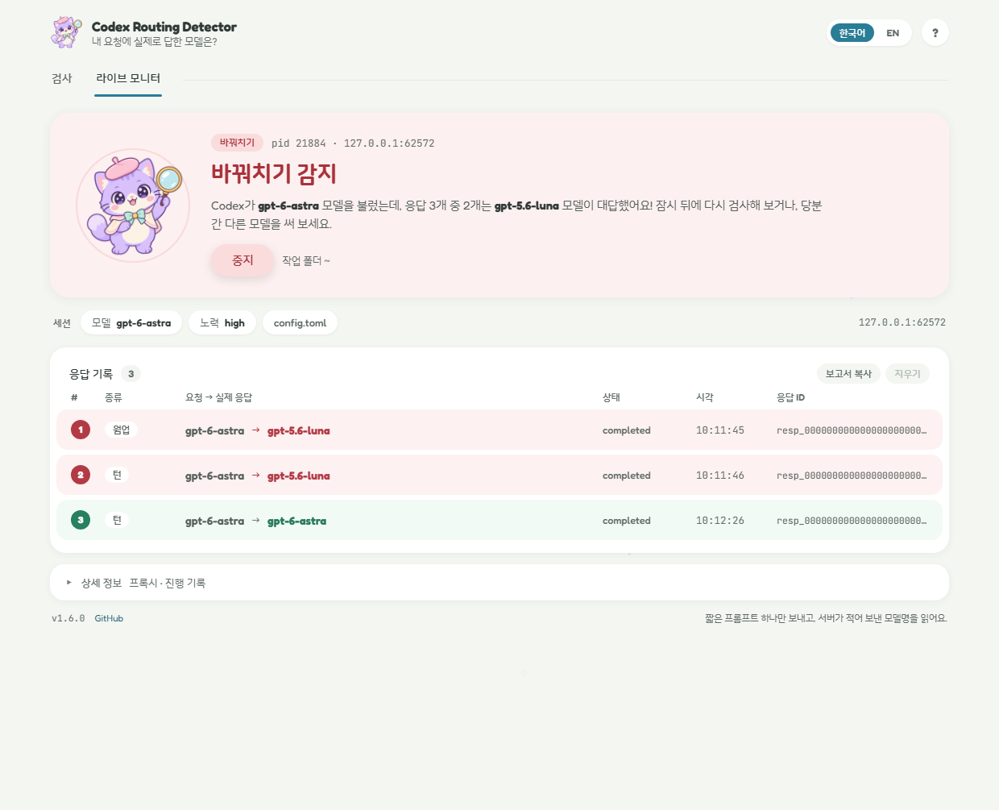

<p align="center">
  
</p>

<h1 align="center">Codex Routing Detector</h1>

<p align="center">
  <b>내가 고른 모델이 정말 대답했을까요? 고양이 탐정이 확인해 드려요! 🔍</b><br>
  <a href="https://github.com/darkdarkcocoa/codex-routing-detector/releases">다운로드</a> ·
  <a href="README.md">English</a> ·
  <a href="#faq">자주 묻는 질문</a>
</p>

---

안녕하세요! 👋

Codex에서 `gpt-6-astra`를 고르면 화면 어디에나 "gpt-6-astra"라고 나와요. 그런데 정말 astra가
대답하고 있을까요? 이 작은 앱은 그걸 **서버**에게 직접 물어보고, 어떤 모델을 불렀고 실제로는
어떤 모델이 대답했는지 한 문장으로 알려 드려요. 🐾

- **검사**: 버튼 한 번 누르고 30초쯤 기다리면 답이 나와요.
- **라이브 모니터**: 내가 Codex CLI로 작업하는 동안 응답 하나하나를 옆에서 지켜봐요.



## 왜 만들었냐면요 💭

2026년 9월, `gpt-6-astra`가 갑자기 하위 모델처럼 느껴지기 시작했어요. "Selected model is at
capacity" 오류도 자주 떴고요. 그래서 Codex와 `chatgpt.com` 사이의 통신을 들여다봤더니, 요청에는
`model: gpt-6-astra`라고 적혀 있는데 서버가 돌려준 응답에는 `model: gpt-5.6-luna`라고 적혀
있었어요. 😿 사용량 한도는 한참 남아 있었고, Codex에는 "모델이 바뀌었다"는 알림이 하나도 없었어요.
화면은 계속 astra라고 표시했고, 사용량도 astra 기준으로 차감됐어요. 다른 분들도 일반 Plus·Pro
계정에서 같은 현상을 따로 재현했어요.

Codex 안에서는 이걸 볼 수 없어요. 화면과 로컬 로그에는 **요청한** 모델만 남기 때문이에요. 이
앱은 서버가 응답에 적어 보낸 모델명, 즉 실제로 실행된 모델을 읽어요. 서버 상태는 시간에 따라
바뀌기도 해요(같은 계정이 한 시간 안에 정상과 바꿔치기를 오갔어요). 그러니 중요할 때마다 한 번씩
확인해 보세요. ✨

## 설치 📦

- **Windows, Python 없이**: [Releases](https://github.com/darkdarkcocoa/codex-routing-detector/releases)에서
  `codex-routing-detector.exe`를 받아 더블클릭하세요. 코드 서명이 없어서 처음 한 번 SmartScreen
  경고가 떠요. "추가 정보" → "실행"을 누르면 돼요.
- **Python 3.8 이상**:
  ```
  pipx install git+https://github.com/darkdarkcocoa/codex-routing-detector
  pipx inject codex-routing-detector pywebview
  ```
  설치한 뒤 `codex-routing-detector-gui`(창)나 `codex-routing-detector`(터미널)를 실행하세요.
  pywebview가 없으면 단순한 tkinter 창이 대신 열려요(`--tk`로 일부러 열 수도 있어요).

ChatGPT로 로그인된 Codex CLI나 Codex Desktop도 있어야 해요. 라이브 모니터는 CLI가 필요해요.

## 바로 쓰기 🚀

설정할 건 없어요.

1. 앱을 열어요. 모델은 `~/.codex/config.toml`에 적힌 것을, 로그인은 Codex의 것을 그대로 써요.
2. **검사하기**를 눌러요. Codex에 짧은 프롬프트 하나를 보낸다는 안내 창이 떠요. 다음부터 안
   보고 싶으면 "다시 묻지 않기"를 켜 두세요.
3. 30초쯤 뒤, 맨 위의 큰 카드가 결과를 알려 줘요.

| | 카드 | 뜻 |
|:-:|---|---|
|  | **바꿔치기 감지** (빨강) | 다른 모델이 대답했어요. 아래 목록에 `gpt-6-astra → gpt-5.6-luna`처럼 요청한 모델과 실제로 대답한 모델이 나란히 보여요. |
|  | **정상** (초록) | 고른 모델이 대답했어요. 🎉 |
|  | **확인 필요** (주황) | 요금제에 없는 모델이라 서버가 거절했거나(다른 모델을 골라 주세요), "at capacity" 같은 서버 오류가 났어요(잠시 뒤 **다시 검사**를 눌러 주세요). |

제목 아래 문장이 무슨 일이 있었는지 쉬운 말로 설명해 줘요. 그 아래 **응답 기록**과 **상세
정보**에는 증거(응답 ID, 플랜, 사용량)가 있어요.

## 라이브 모니터 👀

두 번째 탭은 검사 요청을 보내는 대신 실제 Codex CLI 세션을 지켜봐요. **모니터링 시작**을 누르면
새 터미널 창에 Codex가 열려요. 거기서 요청을 보낼 때마다 서버가 답하는 즉시 목록에 한 줄씩
쌓여요. Codex가 요청한 모델, 실제로 대답한 모델, 판정이 함께 나와요. 작업 도중에 바꿔치기가
시작되면 그 순간 바로 보여요.



- **추가 비용이 없어요.** 모니터는 스스로 요청을 보내지 않아요.
- **처음에 `gpt-5.6-luna → gpt-5.6-luna` 줄이 보여도 정상이에요.** 대화를 시작하면 Codex가 대화 제목
  짓기 같은 잡일을 싸고 빠른 luna에게 따로 맡겨요. *내 모델 → 다른 모델*일 때만 바꿔치기예요.
- **세션** 줄에는 `config.toml`의 `model`과 `model_reasoning_effort`가 보여요. **작업 폴더**는
  Codex 창이 열릴 폴더이고, 한 번 고르면 기억해요.
- **중지**를 누르면 Codex 창도 닫혀요. Codex를 직접 끝내도(`/exit` 또는 Ctrl-C) 모니터가 끝나요.
  기록은 **지우기**를 누를 때까지 남고, **보고서 복사**로 클립보드에 담을 수 있어요.
- 오른쪽 위 **?** 버튼을 누르면 짧은 안내를 다시 볼 수 있어요.
- **Codex 데스크톱 앱은 지켜볼 수 없어요.** 다른 프로그램이 넣어 주는 프록시 설정을 받지 않기
  때문이에요. 데스크톱 앱 사용자도 검사 탭은 그대로 쓸 수 있어요.
- Windows에서 테스트했어요. macOS·Linux에서도 터미널을 열어 보긴 하지만, **중지**로 그 창을 닫을
  수는 없으니 Codex를 직접 끝내 주세요.

<a name="faq"></a>

## 자주 묻는 질문 💬

### 이거 쓰면 Codex 계정이 의심 계정으로 찍히지 않을까요?

평소 Codex를 쓰는 것과 다른 일은 하지 않아요. 검사는 내 로그인 그대로 내 Codex CLI를 실행해서
`Reply with exactly the single word: pong`이라는 프롬프트 하나를 보내요. 서버 입장에서는 내가
Codex에 직접 그렇게 입력한 것과 똑같아요. 라이브 모니터는 스스로 아무것도 보내지 않아요. Codex의
통신을 한 바이트도 바꾸지 않고 그대로 전달하는데, 이 구성은 회사의 TLS 검사 프록시 환경을 위해
Codex가 공식 지원하는 방식이에요([`CODEX_CA_CERTIFICATE`](https://developers.openai.com/codex/auth)).
눈에 보이는 차이는 딱 하나예요. OpenAI와의 암호화 연결을 Codex 대신 Python이 맺는다는 점인데,
회사 프록시 뒤에서 Codex를 쓸 때도 똑같이 그래요. OpenAI가
[공개한 사이버 안전 검사](https://developers.openai.com/api/docs/guides/safety-checks/cybersecurity)는
무엇을 요청했는지와 계정의 활동 패턴을 보는데, 한 단어짜리 "pong"에는 문제 될 내용이 없어요. 다만
OpenAI가 기준을 전부 공개하지는 않아서 누구도 위험이 전혀 없다고 장담할 수는 없어요. 검사를 짧은
간격으로 계속 돌리는 것만 피해 주세요.

### 검사 한 번에 비용이 얼마나 드나요?

작은 요청 2개예요. Codex가 원래 보내는 웜업과 턴 하나예요. 시스템 프롬프트와 도구 정의 때문에
요청마다 입력 토큰이 1만 2천~1만 6천 개쯤 들고, 답은 몇 토큰뿐이에요. 다른 Codex 사용처럼
사용량에서 차감돼요. 라이브 모니터는 추가 비용이 없어요.

### 무엇을 저장하나요?

- **검사**: 서버가 보낸 메시지 원문을 전용 임시 폴더에 남겨요. **로그 폴더**로 열어 볼 수 있어요.
  내가 보낸 요청 본문, 인증 헤더, 쿠키는 저장하지 않아요.
- **라이브 모니터**: 모델명·응답 ID·상태·시각·오류 코드만 메모리에 둬요. **지우기**를 누르거나
  창을 닫으면 사라지고, 디스크에는 아무것도 쓰지 않아요.

자세한 내용은 [개인정보 상세](#개인정보-상세)에 있어요.

### 앱이 알아서 인터넷에 접속하나요?

시작할 때 새 버전이 있는지 `api.github.com`에 익명 요청을 하나 보내는 게 전부예요. 새 버전이
있으면 버전 표시가 빨간 **NEW** 배지로 바뀌고, Windows exe는 새 파일을 받아 GitHub가 공개한
SHA-256으로 검증한 뒤 스스로 다시 실행돼요. `--no-auto-update`는 배지만 남기고 파일은 바꾸지
않아요. `--no-update-check`나 환경 변수 `CODEX_ROUTING_DETECTOR_NO_UPDATE=1`은 확인 자체를 꺼요.
폰트와 그림은 프로그램 안에 들어 있어서, 창은 네트워크에서 아무것도 받아 오지 않아요.

### `openai/gpt-6-astra`가 왜 `gpt-6-astra`로 바뀌나요?

Codex의 모델 이름에는 이런 접두사가 없고, 서버는 접두사가 붙은 이름을 "not supported when using
Codex with a ChatGPT account"라며 거절해요. 그래서 접두사를 떼고 검사한 뒤, **상세 정보**에 그
사실을 적어 둬요.

### 바꿔치기가 나왔어요. 무엇을 제보하면 되나요?

응답 ID, `created_at` 시각(UTC), 요청한 모델과 실제 모델, 플랜과 사용량 줄, Codex 버전이 있으면
돼요. **보고서 복사**(터미널에서는 `--json`)가 전부 모아 줘요. 📮

## 창의 설정들 🎛️

- **모델**: 검사할 모델이에요. 목록은 Codex의 모델 카탈로그에서 가져오고, *직접 입력...*으로
  다른 이름도 적을 수 있어요.
- **반복**: 검사를 1~10번 돌려요. 서버 상태가 시간에 따라 바뀌니까, 세 번쯤 돌리면 안정적인지
  오락가락하는지 보여요.
- **노력**: 검사에 보낼 reasoning effort예요. 고른 모델이 지원하는 단계만 보여 줘요(GPT-6 Sol과
  Luna는 `max`까지). `ultra`는 하위 에이전트를 여럿 띄워서 검사용으로는 비용이 너무 커서 뺐어요.
  `low`가 가장 저렴하고, 지금까지 본 바꿔치기는 이 값과 상관없었어요.
- **Wire 모드**: 판정은 같지만, mitmproxy로 Codex 바깥에서 통신을 기록해요. Codex가 보낸 요청까지
  남아서 남을 설득할 증거가 필요할 때 좋아요. `pip install mitmproxy`로 설치하면 켤 수 있어요.
- **codex · 자동 탐지**: `codex` 실행 파일을 알아서 찾아요. 못 찾을 때만 눌러서 직접 골라 주세요.
- **웜업 / 턴**: Codex는 세션마다 요청을 두 번 보내요. 자동으로 가는 웜업과 실제 프롬프트인
  턴이에요. 어느 쪽이든 다른 모델이 대답하면 바꿔치기예요.
- **보고서 복사 / JSON 저장 / 로그 폴더**: 증거를 텍스트로, JSON으로, 서버 메시지 원문으로 줘요.
- 오른쪽 위 **한국어 / EN**으로 도움말까지 모든 글자를 바꿀 수 있어요.

## 터미널 버전 ⌨️

```
codex-routing-detector                        # config.toml의 모델 + 대조군 모델
codex-routing-detector -m gpt-6-astra         # 특정 모델만
codex-routing-detector -r 3                   # 3번 반복
codex-routing-detector --json out.json --full-ids
codex-routing-detector --wire                 # mitmproxy로 패킷 수준 확인
codex-routing-detector --live                 # 내 Codex CLI 세션을 새 창에서 지켜보기
```

소스에서 바로 쓸 때는 `python codex_routing_detector.py`로 똑같이 돼요.

종료 코드는 `0`(모두 요청대로 응답), `2`(대조군을 포함해 하나라도 다른 모델이 응답), `1`(확인
실패 또는 인자 오류)이에요.

<details>
<summary><b>모든 옵션</b></summary>

| 옵션 | 뜻 |
|---|---|
| `-m/--model MODEL` | 검사할 모델(여러 번 지정 가능). 기본값: `~/.codex/config.toml`의 `model`, 없으면 `gpt-6-astra` |
| `--control MODEL` / `--no-control` | 함께 검사할 대조군 모델(기본 `gpt-5.6-sol`, 검사 모델과 같으면 건너뜀). 대조군은 정상인데 내 모델만 다르면 그 모델에만 바꿔치기가 일어난다는 뜻이에요 |
| `-e/--effort LEVEL` | 검사에 쓸 `model_reasoning_effort`. 기본 `low`이고, `config.toml`의 값은 쓰지 **않아요** |
| `-t/--tier TIER` | `service_tier` 지정. 기본값은 `config.toml`에 적힌 값 |
| `-r/--repeat N` | 검사를 N번 반복 |
| `--prompt TEXT` | 검사 턴에 쓸 프롬프트(특별한 이유가 없으면 기본값을 쓰세요) |
| `--timeout SEC` | 검사 하나의 제한 시간(기본 240초). 넘으면 프로세스 트리 전체를 종료해요 |
| `--codex PATH` | codex 실행 파일(`CODEX_BIN`도 가능) |
| `--wire` | trace 로그 대신 mitmproxy 사용 |
| `--live` | 실제 Codex CLI 세션을 새 터미널 창에서 지켜보기. `--` 뒤의 인자는 codex로 넘어가요 |
| `--live-dir DIR` | `--live`에서 Codex를 열 폴더(기본: 현재 폴더) |
| `--json FILE` | 기계가 읽을 수 있는 보고서 |
| `--out DIR` | 로그를 남길 폴더(기본: 새 전용 임시 폴더) |
| `--full-ids` | 응답 ID 전체 출력 |
| `--no-update-check` / `--no-auto-update` | 자주 묻는 질문 참고 |
| `--version` | 버전 출력 |

</details>

## 속 이야기 🔧

<details>
<summary><b>판정 종류 전부</b></summary>

- `REROUTED`: 서버의 응답 객체에 요청과 다른 모델명이 적혀 있어요. 대소문자 차이는 그냥
  넘어가고, 요청한 모델의 날짜 붙은 스냅샷(`gpt-6-astra-2026-09-01`)은 인정하되 행 아래에 적어
  둬요. `response.created`와 `response.completed` 사이에 모델명이 바뀌어도 `REROUTED`예요.
- `ok`: 요청대로 응답했고 턴이 정상 완료됐어요.
- `UNSUPPORTED`: 서버가 이 계정에서는 그 모델을 쓸 수 없다고 거절했어요("not supported when using
  Codex with a ChatGPT account" 등). 요금제에 없는 모델이라는 뜻이고 바꿔치기가 아니에요. 이때
  웜업이 요금제 기본 모델로 응답된 건 바꿔치기로 세지 않아요.
- `ERROR`: 서버 오류예요. 예: `server_is_overloaded`(Codex 화면의 "Selected model is at capacity").
  응답 객체가 있었다면 요청한 모델명이 적혀 있었어요. 다시 시도하세요. 다른 모델명을 적은 뒤
  실패한 응답은 여전히 `REROUTED`예요.
- `UNKNOWN`: 확인할 수 없었어요. 응답 객체에 `model` 필드가 없거나, 턴이 `completed`까지 가지
  못했거나(시간 초과, 비정상 종료, `incomplete`, `cancelled`), 웜업만 보인 경우예요.
- `NO_DATA`: WebSocket 메시지가 하나도 없었어요. Codex 종료 코드와 마지막 오류 줄을 함께 적어요
  (로그인 안 됨, API 키 모드, 네트워크 없음 등). Codex가 정상 종료했는데 WebSocket 통신이 없었다면
  HTTP로 통신하는 구버전 Codex이니 `--wire`를 쓰거나 업데이트하세요. 사용자 지정
  `model_provider`(Bedrock, OSS 등)는 `chatgpt.com`을 거치지 않아서 확인할 수 없어요.

</details>

<details>
<summary><b>동작 원리</b></summary>

**검사(기본 trace 모드).** 실제 `codex exec`를
`RUST_LOG=tungstenite::protocol=trace,tungstenite::protocol::frame=off`로 실행해요. `tungstenite`는
Codex 안의 WebSocket 라이브러리로, 이 로그 레벨에서는 받은 메시지를 Codex 코드가 손대기 전에 원문
그대로 남겨요. 앱은 거기서 서버의 `response.created` / `response.completed`에 적힌
`response.model`을 읽어요. 보내는 메시지는 압축된 채로 기록되기 때문에, *요청한* 모델은 앱이
넘기는 `-c model=...` 값을 쓰고 Codex 시작 화면의 `model:` 줄과 대조해요.

검사마다 새 Codex 세션을 써요(지원하는 버전에서는 `--ephemeral`, 샌드박스 `read-only`, `notify`
훅 끔. MCP 서버와 플러그인은 그대로 로드돼요).

**Wire 모드.** 전용 임시 폴더에 만든 일회용 인증 기관으로 mitmproxy를 로컬 HTTPS 프록시로 띄워요.
Codex를 실행할 때 `HTTPS_PROXY`는 그 프록시를, `CODEX_CA_CERTIFICATE`는 그 인증서를 가리키게 해서
시스템 인증서 저장소에는 아무것도 설치하지 않아요. responses WebSocket의 양방향을 기록해요.
2026-09-22에 trace 모드와 Wire 모드를 나란히 돌려 서버 응답 객체가 똑같다는 걸 확인했어요.

**라이브 모니터.** 같은 방식을 mitmproxy 없이 구현했어요. `codex_routing_proxy.py`는
127.0.0.1에서만 연결을 받는 CONNECT 프록시로, 세션마다 새로 만든 인증 기관(EC P-256,
`cryptography` 패키지 사용)으로 TLS를 종료하고 실제 서버 쪽으로 다시 암호화해서 모든 바이트를
그대로 중계해요. responses WebSocket에서만 프레임(마스킹, 분할, context takeover가 있는
`permessage-deflate`)을 해독해 클라이언트의 `response.create`에 적힌 모델과 서버의 응답 객체를
읽어요. `codex_routing_live.py`가 이를 응답당 한 줄로 정리해요.

</details>

<a name="개인정보-상세"></a>
<details>
<summary><b>개인정보 상세</b></summary>

- **검사 로그**는 마지막에 출력되는 폴더(`--out`이 없으면 전용 임시 폴더)에 남아요. 서버 메시지,
  즉 스레드·세션 ID, `safety_identifier`에 든 계정 사용자 ID, 검사 프롬프트, 플랜과 사용량이
  들어 있어요. 내가 보낸 메시지(작업 폴더 경로를 포함한 요청 전체)는 저장 전에 버려요. Wire
  모드에서는 클라이언트 요청을 라우팅 관련 필드(`model`, `service_tier`, `reasoning` 등)만 남기고
  줄여요. 인증 헤더와 쿠키는 기록되지 않고, `x-codex-turn-state` 토큰은 가리고, 홈 폴더 경로는
  `~`로 적어요. 필요 없으면 폴더를 지워 주세요.
- **`--json` 보고서**에는 사용자 이름이 든 경로가 없어요. 다만 플랜·사용량·크레딧 잔액은 제보에
  유용해서 남겨 두니, 공유하기 싫으면 지워 주세요.
- **업데이트 확인 말고는 앱이 스스로 하는 네트워크 통신이 없어요.** trace 모드에서는 이미 설치된
  Codex를 실행하기만 해요. Wire 모드에서는 검사하는 동안 Codex의 모든 HTTPS 요청(토큰 갱신, 원격
  측정 포함)이 로컬 mitmproxy를 지나가고, 기록하는 건 responses WebSocket뿐이에요.
- **라이브 모니터**: 세션 동안 Codex의 모든 HTTPS 통신(토큰 갱신, 원격 측정, 네트워크 MCP 서버
  포함)이 127.0.0.1의 내장 프록시를 지나가고, 해독하는 건 responses WebSocket뿐이에요. 인증
  기관과 개인 키는 전용 임시 폴더에 있다가 모니터가 멈추면 지워져요. 고른 작업 폴더는 설정
  파일에 기억돼요.
- **자동 업데이트**는 시작 직후에만 하고, 검사 중에는 하지 않고, exe 폴더에 쓰기 권한이 있을 때만
  해요. 크기, `MZ` 헤더, GitHub가 공개한 SHA-256을 확인한 뒤 옛 프로세스가 끝나면 파일을 바꾸고
  "v…로 업데이트됨"이라고 알려 줘요. pip/pipx 설치는 건드리지 않고, 배지와 `pipx upgrade` 안내만
  보여 줘요.
- 검사는 `read-only` 샌드박스에서 돌지만, 사용자 지정 `--prompt`로는 다른 Codex 턴처럼 모델이
  파일을 읽어 OpenAI로 보내게 할 수 있어요.

</details>

<details>
<summary><b>Codex를 찾는 방법</b></summary>

`PATH`에서 `codex`를 찾고, npm 패키지 안의 네이티브 실행 파일을 실행해요(npm, yarn,
심볼릭 링크 방식의 pnpm. Windows의 `codex.cmd`는 실제 실행 파일로 풀어요). CLI가 없으면 Windows
데스크톱 번들(`%LOCALAPPDATA%\OpenAI\Codex\bin\*\codex.exe`)과, 검증하지는 않았지만 macOS의
`/Applications/Codex.app/Contents/Resources/codex`를 찾아봐요. 그래도 없으면 `--codex PATH`,
`CODEX_BIN` 환경 변수, 또는 창의 **codex · 자동 탐지**를 쓰세요.

</details>

<details>
<summary><b>앱 없이 직접 확인하기</b></summary>

`--ephemeral`을 모르는 Codex 버전에서는 그 옵션을 빼 주세요.

bash / Git Bash:

```
RUST_LOG='tungstenite::protocol=trace,tungstenite::protocol::frame=off' codex exec --ephemeral -s read-only --skip-git-repo-check \
  -c model=gpt-6-astra "Reply with exactly the single word: pong" 2>&1 </dev/null \
  | grep -o '"type":"response.completed","response":{"id":"[^"]*"[^}]*"model":"[^"]*"' \
  | grep -o '"model":"[^"]*"'
```

PowerShell:

```
$env:RUST_LOG = 'tungstenite::protocol=trace,tungstenite::protocol::frame=off'
codex exec --ephemeral -s read-only --skip-git-repo-check -c model=gpt-6-astra "Reply with exactly the single word: pong" 2>&1 |
  Select-String -Pattern '"type":"response.completed".*?"model":"([^"]+)"' | ForEach-Object { $_.Matches[0].Groups[1].Value }
Remove-Item Env:RUST_LOG
```

둘 다 실제로 응답한 모델을 웜업에 한 번, 턴에 한 번 출력해요. 턴이 실패하면("at capacity" 등)
아무것도 출력하지 않으니 다시 실행해 주세요.

</details>

## 만든 것들 💜

- 라벤더 고양이 탐정과 "Soft Sheet" 창 디자인은 `design_handoff_routing_detector_ui/`에 있어요.
- 폰트: Fredoka(영문), 나눔스퀘어라운드(한글), JetBrains Mono(응답 ID와 시각). 모두 SIL 오픈 폰트
  라이선스 1.1을 따르고, 저작권 안내는 [`docs/FONT-LICENSES.txt`](docs/FONT-LICENSES.txt)에 있어요.
- 빌드, 테스트, 디자인 메모: [`docs/DEVELOPMENT.md`](docs/DEVELOPMENT.md)
- [MIT 라이선스](LICENSE)로 공개해요.

<p align="center">즐거운 코딩 되세요! 부른 모델이 늘 제대로 대답하길 바라요 🐾</p>
