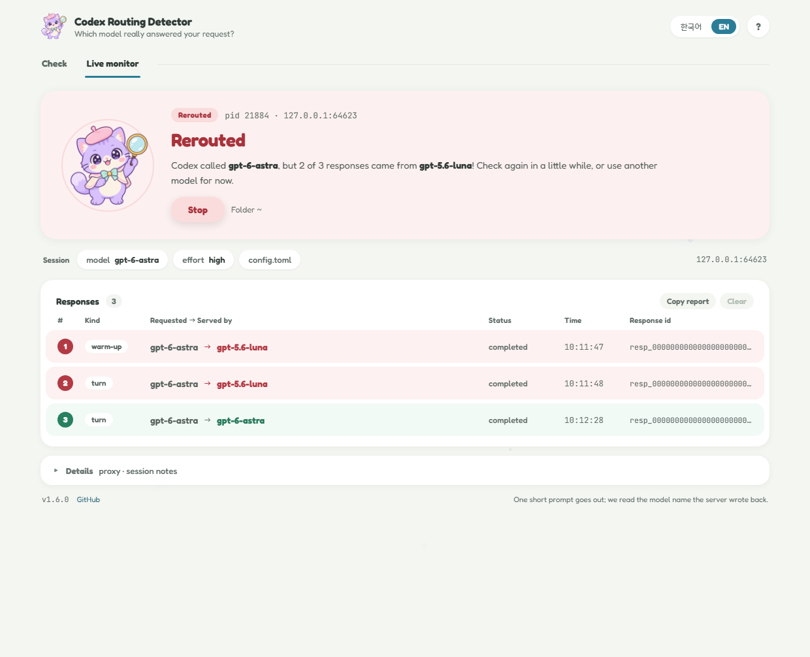

<p align="center">
  
</p>

<h1 align="center">Codex Routing Detector</h1>

<p align="center">
  <b>Did the model you picked really answer? Let the cat detective check! 🔍</b><br>
  <a href="https://github.com/darkdarkcocoa/codex-routing-detector/releases">Download</a> ·
  <a href="README.ko.md">한국어</a> ·
  <a href="#faq">FAQ</a>
</p>

---

Hi there! 👋

You pick `gpt-6-astra` in Codex, and Codex happily says "gpt-6-astra" everywhere. But is
astra really the one answering? This little app asks the **server** and tells you, in one
friendly sentence, which model you called and which model actually replied. 🐾

- **Check**: press one button, wait about 30 seconds, and get the answer.
- **Live monitor**: keeps an eye on your own Codex CLI session while you work, response by
  response.


## Why I made this 💭

In September 2026, `gpt-6-astra` suddenly started to feel like a smaller model, together with
bursts of "Selected model is at capacity". So I looked at the traffic between Codex and
`chatgpt.com`. The request said `model: gpt-6-astra`, but the server's own response said
`model: gpt-5.6-luna`. 😿 The account was far from its usage limit, Codex showed no "rerouted"
notice, the window kept saying astra, and the usage meter kept charging for astra. Other people
reproduced the same thing on ordinary Plus and Pro accounts.

You can't see this from inside Codex, because the window and the local logs only record the
model you *asked for*. This app reads the model name the server writes into its response, which
is the model that really ran. The state also changes over time (one account went back and forth
between OK and rerouted within an hour), so check whenever it matters. ✨

## Install 📦

- **Windows, no Python needed**: download `codex-routing-detector.exe` from
  [Releases](https://github.com/darkdarkcocoa/codex-routing-detector/releases) and double-click
  it. The exe has no code signature, so SmartScreen warns once: "More info" → "Run anyway".
- **Python 3.8+**:
  ```
  pipx install git+https://github.com/darkdarkcocoa/codex-routing-detector
  pipx inject codex-routing-detector pywebview
  ```
  Then run `codex-routing-detector-gui` (window) or `codex-routing-detector` (terminal).
  Without pywebview you get a simpler tkinter window (`--tk` opens that one on purpose).

You also need a Codex CLI or Codex Desktop that is signed in with ChatGPT. The live monitor
needs the CLI.

## Quick start 🚀

There is nothing to set up.

1. Open the app. It already knows your model (from `~/.codex/config.toml`) and uses your Codex
   login.
2. Press **Check**. A small dialog explains that one short prompt goes to Codex. Tick
   "Don't ask again" if you don't want to see it next time.
3. About 30 seconds later, the big card at the top tells you what happened:

| | Card | What it means |
|:-:|---|---|
|  | **Rerouted** (red) | Another model answered. The list below shows the pair, for example `gpt-6-astra → gpt-5.6-luna`. |
|  | **All good** (green) | The model you picked answered. 🎉 |
|  | **Needs a look** (amber) | Your plan doesn't include that model (pick another one), or the server returned an error such as "at capacity" (press **Check again** in a moment). |

The sentence under the headline explains it in plain words. **Responses** and **Details** below
it hold the evidence: response ids, plan and usage.

## Live monitor 👀

The second tab watches a real Codex CLI session instead of sending a probe. Press **Start
monitoring**: a new terminal window opens with Codex, and every request you make there shows up
as soon as the server answers, with the model Codex asked for, the model that really answered,
and the verdict. If a substitution starts halfway through your afternoon, you see it right
away.



- **It costs nothing extra.** The monitor sends no requests of its own.
- **Session** shows the `model` and `model_reasoning_effort` from `config.toml`. **Folder** is
  where the Codex window opens, and the app remembers it.
- **Stop** closes the Codex window too. Closing Codex yourself (`/exit` or Ctrl-C) ends the
  monitor as well. Rows stay until you press **Clear**, and **Copy report** puts them on the
  clipboard.
- The **?** button at the top right brings back the short guide.
- **The Codex desktop app can't be watched**, because it doesn't take proxy settings from
  another program. Desktop users can still use the Check tab.
- It was tested on Windows. On macOS and Linux the terminal opens on a best-effort basis, and
  **Stop** can't close it there, so close Codex yourself.

<a name="faq"></a>

## FAQ 💬

### Can this get my Codex account flagged?

It does nothing that ordinary Codex use doesn't. A check runs your own Codex CLI, signed in as
you, with the prompt `Reply with exactly the single word: pong`. To the server, that is exactly
the same as typing it into Codex yourself. The live monitor sends nothing of its own. It passes
Codex's traffic through byte for byte, using the setup Codex officially supports for company
networks with TLS-inspecting proxies
([`CODEX_CA_CERTIFICATE`](https://developers.openai.com/codex/auth)). The one visible
difference is that the encrypted connection to OpenAI is opened by Python instead of by Codex,
which is also what happens behind a company proxy. OpenAI's
[published cyber-safety checks](https://developers.openai.com/api/docs/guides/safety-checks/cybersecurity)
look at what you ask for and at patterns on the account, and a one-word "pong" asks for nothing.
OpenAI doesn't publish every rule, so nobody can promise zero risk. Just don't run checks in a
tight loop.

### What does a check cost?

Two small requests: Codex's usual warm-up plus one turn. Each carries about 12-16k input tokens
of system prompt and tool definitions, and the answer is a few tokens. It counts against your
Codex usage like any other turn. The live monitor adds nothing.

### What does it keep?

- **Check**: raw server messages go to a private temp folder, which you can open with **Log
  folder**. Your request bodies, auth headers and cookies are never saved.
- **Live monitor**: only model names, response ids, statuses, times and error codes, in memory,
  until you press **Clear** or close the window. Nothing is written to disk.

The details are under [Privacy in detail](#privacy-in-detail).

### Does it talk to the internet on its own?

It makes one anonymous request to `api.github.com` at startup to look for a new release, and
nothing else. When a new release exists, the version label turns into a red **NEW** badge and
the Windows exe updates itself: it downloads the new file, checks its SHA-256 against GitHub,
and restarts. `--no-auto-update` keeps the badge but never replaces the file.
`--no-update-check` or `CODEX_ROUTING_DETECTOR_NO_UPDATE=1` turns the check off completely. The
fonts and pictures are built into the program, so the window loads nothing from the network.

### Why does `openai/gpt-6-astra` become `gpt-6-astra`?

Codex model names have no provider prefix, and the server refuses the prefixed name ("not
supported when using Codex with a ChatGPT account"). So the app checks the plain name and says
so under **Details**.

### I saw "Rerouted". What should I report?

Send the response ids, the `created_at` times (UTC), the requested/served pair, your plan and
usage line, and your Codex version. **Copy report** (or `--json` on the command line) puts all
of it together for you. 📮

## Window options 🎛️

- **model**: the model to test. The list comes from Codex's own catalog. *Type a model...* takes
  any other name.
- **repeat**: run the check 1 to 10 times. The server changes over time, so three runs show
  whether it is stable or flickering.
- **effort**: the reasoning effort sent with the probe. Only the levels the chosen model
  supports are offered (GPT-6 Sol and Luna go up to `max`). `ultra` is left out, because it
  spawns sub-agents and costs far too much for a probe. `low` is the cheapest, and the
  substitutions seen so far didn't depend on it.
- **Wire mode**: gives the same verdict, but records the traffic from outside Codex with
  mitmproxy, including what Codex sent. It is useful when you need to convince someone. Install
  it with `pip install mitmproxy`.
- **codex · auto-detect**: finds your `codex` by itself. Click it only if it can't.
- **warm-up / turn**: Codex sends two requests per session: an automatic warm-up and the real
  turn. Either one answered by another model counts as rerouted.
- **Copy report / Save JSON / Log folder**: the evidence as text, as JSON, and as raw server
  messages.
- **한국어 / EN** at the top right switches every label, help included.

## Command line ⌨️

```
codex-routing-detector                        # model from config.toml + control model
codex-routing-detector -m gpt-6-astra         # a specific model
codex-routing-detector -r 3                   # repeat each probe 3 times
codex-routing-detector --json out.json --full-ids
codex-routing-detector --wire                 # packet-level capture with mitmproxy
codex-routing-detector --live                 # watch a Codex CLI session in a new window
```

From a checkout, `python codex_routing_detector.py` does the same.

Exit codes: `0` means every checked model was served as requested, `2` means at least one probe
(control included) was served by another model, and `1` means a model couldn't be checked or
there was a usage error.

<details>
<summary><b>All options</b></summary>

| Option | Meaning |
|---|---|
| `-m/--model MODEL` | model to check (repeatable). Default: `model` in `~/.codex/config.toml`, else `gpt-6-astra` |
| `--control MODEL` / `--no-control` | control model checked alongside (default `gpt-5.6-sol`; skipped when it equals the checked model). If the control is fine and yours is not, the substitution is specific to your model |
| `-e/--effort LEVEL` | `model_reasoning_effort` for the probes. Default `low`; the value in `config.toml` is **not** used |
| `-t/--tier TIER` | `service_tier` override. Default: whatever `config.toml` says, if anything |
| `-r/--repeat N` | run every probe N times |
| `--prompt TEXT` | prompt for the probe turn (keep the default unless you know why) |
| `--timeout SEC` | per-probe timeout (default 240); the whole process tree is killed on timeout |
| `--codex PATH` | codex binary (also `CODEX_BIN`) |
| `--wire` | use mitmproxy instead of trace logging |
| `--live` | watch a real Codex CLI session in a new terminal window; arguments after `--` go to codex |
| `--live-dir DIR` | folder to open Codex in for `--live` (default: current directory) |
| `--json FILE` | machine-readable report |
| `--out DIR` | keep raw logs here (default: a new private temp dir) |
| `--full-ids` | print full response ids |
| `--no-update-check` / `--no-auto-update` | see the FAQ |
| `--version` | print the tool version |

</details>

## Under the hood 🔧

<details>
<summary><b>Reading the result: every verdict</b></summary>

- `REROUTED`: the server's response object names a different model than requested. Case
  differences are accepted silently. A dated snapshot of exactly the requested model
  (`gpt-6-astra-2026-09-01`) is accepted and noted under the row. A model whose name changes
  between `response.created` and `response.completed` is `REROUTED`.
- `ok`: served as requested, and the turn completed.
- `UNSUPPORTED`: the server refused the model for this account ("not supported when using Codex
  with a ChatGPT account" and similar), so your plan doesn't include it. A warm-up answered by
  the plan's default model in that situation isn't counted as a substitution.
- `ERROR`: the server answered with an error (for example `server_is_overloaded`, which Codex
  shows as "Selected model is at capacity"), and the response object, if any, named the
  requested model. Run again. A response that named another model and then failed is still
  `REROUTED`.
- `UNKNOWN`: the model couldn't be confirmed. The response object had no `model` field, the
  turn never reached `completed` (timeout, crash, `incomplete`, `cancelled`), or only the
  warm-up was seen.
- `NO_DATA`: no WebSocket messages were seen. The note quotes Codex's exit code and last error
  line (typically: not signed in, API-key mode, no network). If Codex exited cleanly without any
  WebSocket traffic, it is an older Codex that streams over HTTP, so try `--wire` or upgrade. A
  custom `model_provider` (Bedrock, OSS) never reaches `chatgpt.com` and can't be checked.

</details>

<details>
<summary><b>How it works</b></summary>

**Check (trace mode, the default).** The app runs the real `codex exec` with
`RUST_LOG=tungstenite::protocol=trace,tungstenite::protocol::frame=off`. `tungstenite` is the
WebSocket library inside Codex. At trace level it logs every message it receives, verbatim,
before any Codex code sees it. The app reads `response.model` from the server's
`response.created` / `response.completed` events. Outgoing messages are logged compressed, so
the *requested* model is the `-c model=...` value the app passes, cross-checked against the
`model:` line in Codex's banner.

Each probe is a fresh Codex session (`--ephemeral` where supported, sandbox `read-only`, the
`notify` hook disabled; your MCP servers and plugins still load).

**Wire mode.** mitmproxy runs as a local HTTPS proxy with a throw-away certificate authority in a
private temp directory. Codex is started with `HTTPS_PROXY` pointing at it and
`CODEX_CA_CERTIFICATE` pointing at that certificate, so nothing is installed into the system
certificate store. Both directions of the responses WebSocket are recorded. Trace mode and wire
mode were checked against each other on 2026-09-22, and the server response objects were
identical.

**Live monitor.** The same idea without mitmproxy. `codex_routing_proxy.py` is a CONNECT proxy
on 127.0.0.1 that terminates TLS with a per-session certificate authority (EC P-256, made with
the `cryptography` package), re-encrypts towards the real server and relays every byte
unchanged. Only on the responses WebSocket does it decode the frames (masking, fragmentation,
`permessage-deflate` with context takeover) to read the client's `response.create` model and the
server's response objects. `codex_routing_live.py` turns them into one row per response.

</details>

<a name="privacy-in-detail"></a>
<details>
<summary><b>Privacy in detail</b></summary>

- **Check logs** are kept in the folder printed at the end (a private temp folder unless `--out`
  is given). They contain the server messages: your thread and session ids, the account user id
  in `safety_identifier`, the probe prompt, plan type and usage percentages. Outgoing messages
  (which would contain the whole request, including your working directory) are dropped before
  saving. In wire mode, the client's request messages are reduced to their routing fields
  (`model`, `service_tier`, `reasoning`, ...). Authorization headers and cookies are never
  logged, the `x-codex-turn-state` token is redacted, and your home directory is written as `~`.
  Delete the folder when you don't need it.
- **`--json` reports** contain no paths with your username. They do contain the rate-limit block
  (plan, usage, credit balance), because it is useful in a bug report. Remove it if you would
  rather not share it.
- **Apart from the update check, the app makes no network calls of its own.** In trace mode it
  only runs the Codex you already have. In wire mode, every HTTPS request Codex makes during the
  probe (including token refresh and telemetry) passes through the local mitmproxy, and only the
  responses WebSocket is recorded.
- **Live monitor**: all of Codex's HTTPS traffic during the session (token refresh, telemetry,
  MCP servers on the network) passes through the built-in proxy on 127.0.0.1, and only the
  responses WebSocket is decoded. The certificate authority and its private key live in a
  private temp folder and are deleted when the monitor stops. The working folder you pick is
  remembered in the settings file.
- **Self-update** only happens right after startup, never during a check, and only when the
  exe's folder is writable. The app verifies the size, the `MZ` header and the SHA-256 digest
  GitHub publishes, swaps the file after the old process exits, and says "Updated to v…".
  pip/pipx installs are never touched; they get the badge and a `pipx upgrade` hint.
- The probe runs in a `read-only` sandbox, but a custom `--prompt` can still make the model read
  files and send them to OpenAI, like any Codex turn.

</details>

<details>
<summary><b>How Codex is found</b></summary>

The app looks for `codex` on `PATH` and runs the native binary inside the npm package (npm,
yarn, pnpm-as-symlink; `codex.cmd` on Windows is resolved to the binary). Without a CLI it tries
the Windows Desktop bundle (`%LOCALAPPDATA%\OpenAI\Codex\bin\*\codex.exe`) and, unverified,
`/Applications/Codex.app/Contents/Resources/codex` on macOS. Otherwise pass `--codex PATH`, set
`CODEX_BIN`, or click **codex · auto-detect** in the window.

</details>

<details>
<summary><b>Checking by hand, without this app</b></summary>

Drop `--ephemeral` on Codex versions that don't know the flag.

bash / Git Bash:

```
RUST_LOG='tungstenite::protocol=trace,tungstenite::protocol::frame=off' codex exec --ephemeral -s read-only --skip-git-repo-check \
  -c model=gpt-6-astra "Reply with exactly the single word: pong" 2>&1 </dev/null \
  | grep -o '"type":"response.completed","response":{"id":"[^"]*"[^}]*"model":"[^"]*"' \
  | grep -o '"model":"[^"]*"'
```

PowerShell:

```
$env:RUST_LOG = 'tungstenite::protocol=trace,tungstenite::protocol::frame=off'
codex exec --ephemeral -s read-only --skip-git-repo-check -c model=gpt-6-astra "Reply with exactly the single word: pong" 2>&1 |
  Select-String -Pattern '"type":"response.completed".*?"model":"([^"]+)"' | ForEach-Object { $_.Matches[0].Groups[1].Value }
Remove-Item Env:RUST_LOG
```

Both print the served model once for the warm-up and once for the turn. A turn that failed (for
example "at capacity") prints nothing, so run it again.

</details>

## Credits 💜

- The lavender cat detective and the "Soft Sheet" window design are in
  `design_handoff_routing_detector_ui/`.
- Fonts: Fredoka (latin), NanumSquareRound (Korean) and JetBrains Mono (ids and times), all
  under the SIL Open Font License 1.1. Their notices are in
  [`docs/FONT-LICENSES.txt`](docs/FONT-LICENSES.txt).
- Building, tests and design notes: [`docs/DEVELOPMENT.md`](docs/DEVELOPMENT.md).
- Released under the [MIT License](LICENSE).

<p align="center">Happy coding, and may your models always be who they say they are! 🐾</p>
