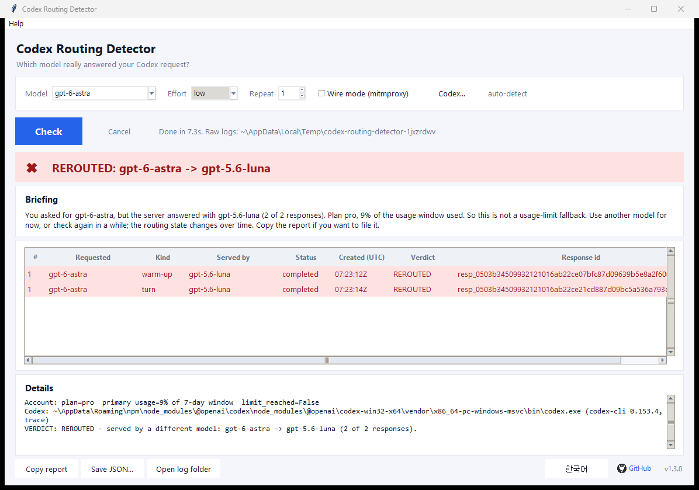

# Codex Routing Detector

[한국어 설명 (Korean)](README.ko.md)

Shows which model **actually** answers your Codex requests. Run it, press Check, and it tells
you whether the `gpt-6-astra` you selected was really served by `gpt-6-astra` or quietly by
`gpt-5.6-luna`.



## Why this exists

In September 2026 many Codex users noticed that `gpt-6-astra` suddenly felt like a smaller
model, alongside bursts of "Selected model is at capacity" errors. Capturing the traffic between
the Codex client and `chatgpt.com` showed why: the request said `model: gpt-6-astra`, but the
server's own response object said `model: gpt-5.6-luna`. Requests for `gpt-5.6-sol`, `terra` and
`luna` in the same minutes were served correctly, the account was nowhere near its usage limit,
and the client was never told. Codex has a `model/rerouted` notification and a "switched
because of usage limits" banner in its protocol, and neither fired. The UI kept saying astra;
the usage meter charged for astra; the answers came from luna. The same thing was reproduced
independently by other people on ordinary Plus and Pro accounts.

You cannot see this from inside Codex: the UI and the local session logs only record the model
you *asked for*. This tool reads the model name the **server** puts into its response objects,
which is the model that actually ran, and reports the mismatch. The state flips over time (the
same account went REROUTED -> OK -> REROUTED within an hour), so check whenever it matters.

## Install

- **Windows, no Python**: download `codex-routing-detector.exe` from
  [Releases](https://github.com/darkdarkcocoa/codex-routing-detector/releases) and double-click it
  (SmartScreen warns once: "More info" -> "Run anyway").
- **Python 3.8+**: `pipx install git+https://github.com/darkdarkcocoa/codex-routing-detector`,
  then `codex-routing-detector-gui` (window) or `codex-routing-detector` (terminal).

Either way you need a Codex CLI or Codex Desktop that is signed in with ChatGPT.

## Quick start

No setup. Open it and press **Check**.

1. Start `codex-routing-detector.exe` (or `codex-routing-detector-gui`).
2. Press **Check** and confirm the small dialog (it explains that one short prompt goes to Codex;
   tick "Don't ask again" to skip it next time). The app already knows your model from
   `~/.codex/config.toml` and your Codex login.
3. About 30 seconds later, read the banner:
   - **REROUTED: gpt-6-astra -> gpt-5.6-luna** (red): the server answered with a different model.
   - **OK** (green): the model you chose answered.
   - **Could not check** (orange): a server error such as "at capacity". Press Check again.

Under the banner, the **Briefing** card says in plain words what happened and what to do next;
the table and the details underneath carry the evidence (response ids, plan, usage).

That is the whole check. Everything below is optional.

## More details (optional)

- **Model**: the one you want to test. (The command line can also check a *control* model right
  after it with `--control`; if that one is fine while yours is not, the substitution is specific
  to your model. The window keeps things simple and does not do this.)
- **Repeat**: run the check N times (1 to 10). The server's behaviour changes over time, so
  three runs tell you whether it is stable or flickering.
- **Effort**: reasoning effort sent with the probe. `low` is the cheapest; the substitution seen
  so far did not depend on it.
- **Wire mode**: same verdict, different evidence. The default reads the server frames from
  inside the Codex process; wire mode records the traffic outside it with mitmproxy, including
  what Codex sent. Use it when you need to convince someone else. Needs `pip install mitmproxy`.
- **Codex... / auto-detect**: the tool finds your `codex` binary by itself (PATH, npm package,
  Codex Desktop bundle). The button is only for the rare case where it cannot.
- **warm-up / turn**: Codex sends two requests per session. The *warm-up* is an automatic
  request with no user input that opens the connection; the *turn* is the real prompt. Both are
  listed. Either one answered by another model counts as REROUTED; **ok** needs the turn.
- **Copy report / Save JSON / Open log folder**: the text report with full response ids (for a
  bug report or a support ticket), the same as JSON, and the raw server frames.
- **NEW badge / auto-update**: at startup the app looks for a newer release. The exe downloads
  it, verifies it and restarts itself; the badge at the bottom right links to the release page.
  See "Cost and privacy" for how to turn that off.
- **한국어 / English** switches every label, the help texts included.

## How Codex is found

The tool looks for `codex` on `PATH` and runs the native binary inside the npm package (npm,
yarn, pnpm-as-symlink; `codex.cmd` on Windows is resolved to the binary). Without a CLI it
tries the Windows Desktop bundle (`%LOCALAPPDATA%\OpenAI\Codex\bin\*\codex.exe`) and, unverified,
`/Applications/Codex.app/Contents/Resources/codex` on macOS. Otherwise pass `--codex PATH`, set
`CODEX_BIN`, or use the window's **Codex...** button. `--wire` additionally needs
`pip install mitmproxy` (7.0 or newer).

## Usage

```
python codex_routing_detector.py                      # model from ~/.codex/config.toml + control
python codex_routing_detector.py -m gpt-6-astra       # a specific model
python codex_routing_detector.py -m gpt-6-astra -m gpt-5.5 --no-control
python codex_routing_detector.py -e high -t priority  # probe with a given effort / service tier
python codex_routing_detector.py -r 3                 # repeat each probe 3 times
python codex_routing_detector.py --json result.json --full-ids
python codex_routing_detector.py --wire               # packet-level capture with mitmproxy
```

| Option | Meaning |
|---|---|
| `-m/--model MODEL` | model to check (repeatable). Default: top-level `model` in `~/.codex/config.toml`, else `gpt-6-astra` |
| `--control MODEL` / `--no-control` | control model run alongside (default `gpt-5.6-sol`; skipped when it equals the checked model) |
| `-e/--effort LEVEL` | `model_reasoning_effort` for the probes. Default `low` (cheapest); the value in `config.toml` is **not** used |
| `-t/--tier TIER` | `service_tier` override. Default: whatever `config.toml` says, if anything |
| `-r/--repeat N` | run every probe N times |
| `--prompt TEXT` | prompt used for the probe turn |
| `--timeout SEC` | per-probe timeout (default 240); the whole process tree is killed on timeout |
| `--codex PATH` | codex binary (also `CODEX_BIN`) |
| `--wire` | use mitmproxy instead of trace logging |
| `--json FILE` | machine-readable report |
| `--out DIR` | keep raw logs here (default: a new private temp dir) |
| `--full-ids` | print full response ids (for bug reports) |
| `--version` | print the tool version |

Exit code: `0` every checked model was served as requested (a control probe or a repeat that
hit a server error does not change this; the summary says so), `2` at least one probe (control
included) was served by a different model, `1` a model could not be checked at all, or a usage
error.

## How it works

**trace (default).** The tool runs the real `codex exec` with
`RUST_LOG=tungstenite::protocol=trace,tungstenite::protocol::frame=off`. `tungstenite` is the
WebSocket library underneath Codex. At trace level it logs every message it receives from the
socket, verbatim, before any Codex code sees it. The tool parses those `Received message {...}`
lines and reads `response.model` from the server's `response.created` / `response.completed`
events. Outgoing frames are logged compressed, so the *requested* model is the `-c model=...`
value the tool passes, cross-checked against the `model:` line Codex prints in its banner.

**--wire.** mitmproxy runs as a local HTTPS proxy with a throw-away certificate authority
created in a private temp directory. Codex is started with `HTTPS_PROXY` pointing at the proxy
and `CODEX_CA_CERTIFICATE` pointing at that certificate (Codex's own custom-CA setting), so
nothing is installed into the OS certificate store; the proxy and its temporary certificate are
removed when the run ends, is cancelled, or the window is closed. Both
directions of the responses WebSocket are recorded, including the requested model in the
client's `response.create` frame. Trace mode and wire mode were checked against each other on
2026-09-22: the server response objects were identical.

Each probe is a fresh Codex session (`--ephemeral` where the Codex version supports it, sandbox
`read-only`, the `notify` hook disabled; your MCP servers and plugins still load). Codex sends
two requests per session: a warm-up request without user input and the real turn. Both are
shown. A response object that names another model, warm-up or turn, makes the probe
`REROUTED` (it is direct evidence); `ok` requires the turn itself to be served as requested,
so a probe whose turn failed is `ERROR`, not `ok`.

## Reading the result

- `REROUTED` - the server's response object names a different model than requested.
  Case differences are accepted silently; a dated snapshot of exactly the requested model
  (`gpt-6-astra-2026-09-01`) is accepted and noted under the row. A model whose name changes
  between `response.created` and `response.completed` is `REROUTED` and noted.
- `ok` - served as requested.
- `UNSUPPORTED` - the server refused the model for this account ("not supported when using Codex
  with a ChatGPT account" and similar): your plan does not include it. A warm-up answered by the
  plan's default model in that situation is not counted as a substitution.
- `ERROR` - the server answered with an error (for example `server_is_overloaded`, which Codex
  shows as "Selected model is at capacity") and the response object, if there was one, named
  the requested model. Run again. (A response that named another model and then failed is
  still `REROUTED`.)
- `UNKNOWN` - the model could not be confirmed: a response object without a `model` field, a
  turn that never reached `completed` (timeout, crash, `incomplete`, `cancelled`), or only the
  warm-up response was seen. The note under the row says which.
- `NO_DATA` - no WebSocket frames were seen. The note under the row quotes Codex's exit code
  and last error line (typically: not signed in, API-key mode, no network), or, if Codex
  exited cleanly without any WebSocket traffic, suggests `--wire` or an upgrade (older Codex
  streams over HTTP). A custom `model_provider` (Bedrock, OSS) never reaches `chatgpt.com` and
  shows up the same way; it cannot be checked with this tool.

The control probe tells the cases apart: if the control model is served correctly while your
model is not, the substitution is specific to that model, not a broken account or client.

## Cost and privacy

- Each probe is two small requests (roughly 12-16k input tokens of system prompt and tool
  definitions, a few output tokens). With the default control that is four requests per run.
  They count against your Codex usage like any other turn.
- Raw logs are kept in the directory printed at the end (a private temp directory unless
  `--out` is given). They contain the server frames: your thread/session ids, the account user
  id in `safety_identifier`, the probe prompt, the plan type and usage percentages. Outgoing
  frames (which would contain the whole request, including the working directory) are dropped
  before saving; in `--wire` mode the client's request frames are reduced to their routing
  fields (`model`, `service_tier`, `reasoning`, ...) and the prompt, tool list and metadata
  are dropped. Authorization headers and cookies are never logged by the chosen log filter;
  the `x-codex-turn-state` token, which the server sends inside a `codex.response.metadata`
  message, is redacted before anything is written; your home directory is written as `~`.
  Delete the directory if you do not need it.
- The `--json` report contains no paths with your username. It does contain the rate-limit
  block (plan, usage, credit balance) because that is useful in a bug report; remove it if
  you would rather not share it.
- On startup the tool makes one anonymous request to `api.github.com` to see whether a newer
  release exists. Nothing about you is sent. If there is one, the version label in the window
  turns into a red NEW badge that opens the release page, and the command line prints an
  `update` line after the report. Disable the check with `--no-update-check` or the environment
  variable `CODEX_ROUTING_DETECTOR_NO_UPDATE=1`.
- The **Windows exe updates itself**: it downloads the new `codex-routing-detector.exe` from
  the release next to itself, verifies size, `MZ` header and the SHA-256 digest GitHub
  publishes for the asset, swaps the file once the old process has exited, and starts the new
  version, which then reports "Updated to v…". This only happens right after startup, never
  while a check is running, and only when the exe's folder is writable. `--no-auto-update`
  keeps the badge but never replaces the file. Installs made with pip/pipx are not touched;
  they get the badge plus the `pipx upgrade codex-routing-detector` hint.
- Apart from that, in trace mode the tool only runs the Codex binary you already have and makes
  no network calls of its own. In `--wire` mode every HTTPS request Codex makes during the probe
  (including token refresh and telemetry) passes through the local mitmproxy process the tool
  launched on your machine; only the responses WebSocket is recorded.
- The probe runs with the sandbox in `read-only` mode, but a custom `--prompt` can still make
  the model read files and send them to OpenAI, as any Codex turn can. Keep the default prompt
  unless you know what you are doing.

## Reporting

If you see `REROUTED`, the useful facts for a bug report are the response ids, the
`created_at` times (UTC), the requested/served pair, your plan type and usage line, and the
Codex version. `--json` writes all of them.

## Without Python

The same check by hand. Drop `--ephemeral` on Codex versions that do not know the flag.

bash / Git Bash:

```
RUST_LOG='tungstenite::protocol=trace,tungstenite::protocol::frame=off' codex exec --ephemeral -s read-only --skip-git-repo-check \
  -c model=gpt-6-astra "Reply with exactly the single word: pong" 2>&1 </dev/null \
  | grep -o '"type":"response.completed","response":{"id":"[^"]*"[^}]*"model":"[^"]*"' \
  | grep -o '"model":"[^"]*"'
```

PowerShell:

```
$env:RUST_LOG = 'tungstenite::protocol=trace,tungstenite::protocol::frame=off'
codex exec --ephemeral -s read-only --skip-git-repo-check -c model=gpt-6-astra "Reply with exactly the single word: pong" 2>&1 |
  Select-String -Pattern '"type":"response.completed".*?"model":"([^"]+)"' | ForEach-Object { $_.Matches[0].Groups[1].Value }
Remove-Item Env:RUST_LOG
```

Both print the served model once for the warm-up and once for the turn. A turn that failed
(`response.failed`, for example "at capacity") prints nothing; run it again.

## Tests

```
python -m unittest discover -s tests -v
```

`tests/test_gui.py` builds the window off-screen and drives it with the fixture runs; it is
skipped where tkinter has no display. `python codex_routing_detector_gui.py --fake --auto-check`
shows the window with the fixture data instead of a live check (development only; the exe does
not include the fixtures).

The fixtures under `tests/fixtures` are two complete trace runs from 2026-09-22 with every id
replaced by a placeholder: an astra request served by luna, and a request that ended in
`server_is_overloaded`. One test also checks that a timed-out probe kills its whole process
tree.
