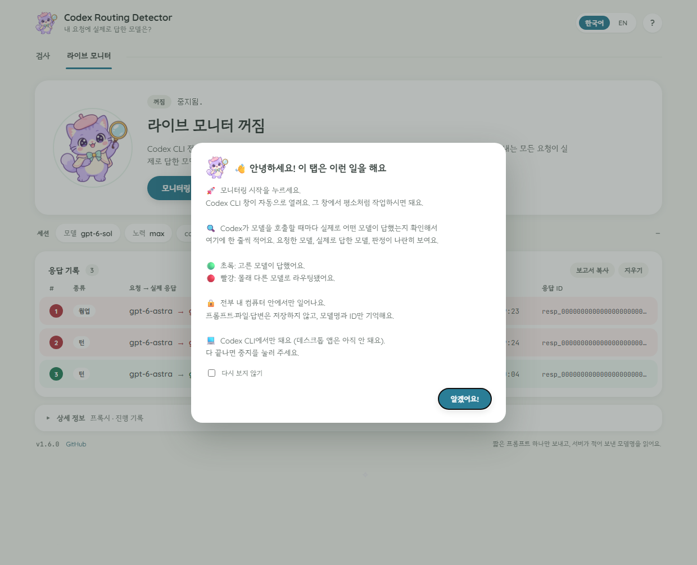

# Development

## Tests and build

```
python -m unittest discover -s tests -v   # parser, verdict and window tests; no real Codex call
build_exe.bat                             # builds dist\codex-routing-detector.exe (PyInstaller)
```

- `tests/test_parse.py` covers the frame parser and the verdicts. One test checks that a
  timed-out probe kills its whole process tree.
- `tests/test_webui.py` drives the window's logic without opening a window, through the data
  the page renders.
- `tests/test_gui.py` and `tests/test_gui_live.py` build the fallback tkinter window off-screen
  and drive both tabs (skipped where tkinter has no display).
- `tests/test_live.py` runs the built-in proxy end to end against a local TLS WebSocket echo
  server (CONNECT, throw-away CA, masked and deflated frames) and checks the live aggregation.

The fixtures under `tests/fixtures` are two complete trace runs from 2026-09-22 with every id
replaced by a placeholder: an astra request served by luna, and a request that ended in
`server_is_overloaded`. `python codex_routing_webui.py --fake --auto-check` shows the window
with this fixture data instead of a live check, and `--fake --fake-live` fills the live tab with
sample rows. Both are for development only; the exe does not include the fixtures.

## Look and feel

The window follows the "Soft Sheet" design in `design_handoff_routing_detector_ui/`: one large
verdict card with the lavender cat detective in it, pill-shaped controls, an airy result list,
and a single teal accent on a sage-tinted background. pywebview (an embedded browser view)
draws it, while all the checking stays in Python. The page is loaded from a temporary file,
because it is larger than WebView2's limit for pages passed as a string.

The mascot pictures and three fonts are embedded in the program (`codex_routing_assets.py`,
`codex_routing_fonts.py`): Fredoka for latin text, NanumSquareRound for Korean and JetBrains
Mono for ids and times. The window therefore loads nothing from the network. All three fonts are
under the SIL Open Font License 1.1; their notices and the license text are in
`docs/FONT-LICENSES.txt`. `tools/make_assets.py` rebuilds the pictures from the source PNGs and
writes `docs/icon.ico`. The READMEs use `docs/mood-*.png` (copies of the files in
`design_handoff_routing_detector_ui/assets/`) and `docs/mascot-animated.svg`, which
`tools/make_mascot_svg.py` builds from the mascot PNG: a CSS hop with twinkling sparkles and a
floating heart, standing still for readers who prefer reduced motion. `docs/social-preview.png` is
the repository's social preview card (1280x640), rendered by `tools/make_social_preview.py` with
headless Edge; GitHub has no API for it, so it is uploaded by hand under Settings > General >
Social preview.

The window's words live in `codex_routing_webtext.py` (Korean and English). The fallback tkinter
window keeps its own strings in `codex_routing_detector_gui.py`.


